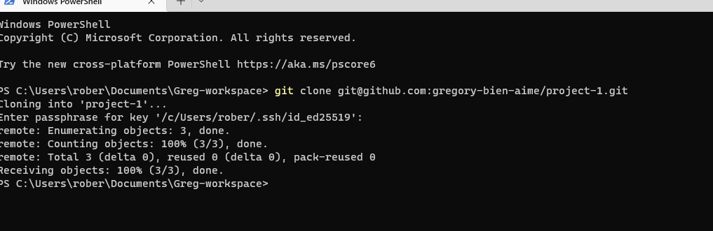

## Awesome Documentation of project 1

"sudo apt update"

"sudo apt install apache2"

'sudo systemctl apache2'

-[Install openssh](https://docs.microsoft.com/en-us/windows-server/administration/openssh/

-[openssh-key management](https://learn.microsoft.com/en-us/windows-server/administration/openssh/openssh_keymanagement)

